# Quiz 1：彩色影像轉灰階影像

## 實驗結果

使用 1920 × 1280 的 `Data/cat.jpg`。

| OpenCV 灰階結果 | NumPy 灰階結果 |
|---|---|
|  | 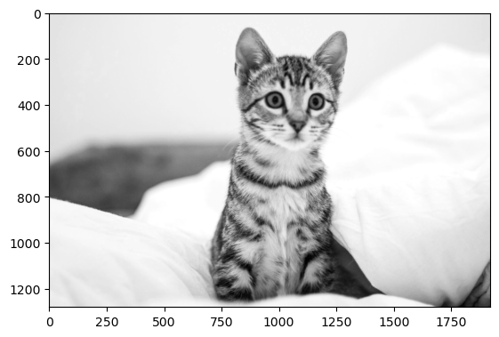 |

兩種方法皆保留貓咪輪廓、毛髮紋理與背景明暗，視覺效果接近。

## 兩種方法的差異

| 比較項目 | OpenCV（cv2） | NumPy |
|---|---|---|
| 實作方式 | 呼叫 `cv2.cvtColor(img, cv2.COLOR_RGB2GRAY)` | 使用 `np.dot(img, color_weight).astype(int)` 加權後轉整數 |
| 灰階權重 | 約為 `0.299R + 0.587G + 0.114B` | `0.2989R + 0.587G + 0.114B` |
| 輸出型態 | `uint8`，整數灰階值 | `int`，截去小數部分（位元數依執行環境） |
| 100 次平均耗時 | **0.62284 ms** | **39.47529 ms** |
| 權重調整 | 本次使用內建 RGB 灰階轉換 | 可直接修改權重陣列 |

**執行時間：** 本次 cv2 耗時約為 NumPy 的 **1/63.38**。

**像素數值：** 紅色通道權重相差 0.0001；單看此係數差異，每個像素的加權結果最多相差 0.0255。兩者目前皆輸出整數，但 NumPy 的 `.astype(int)` 直接截去小數部分，與 OpenCV 的取整方式不同，因此即使視覺接近，像素值也不一定完全相同。

**實測差異：** `np.mean(np.abs(gray_img_np - gray_img))` 得到平均絕對誤差（MAE）為 **0.68067 灰階值**，表示每個像素的絕對差異平均約為 0.68，低於一個灰階級距；此為平均值，不代表所有像素的差異皆小於 1。

---

# Quiz 2：Histogram Equalization

## 實驗結果

使用第一題 OpenCV 產生的灰階影像 `gray_img`，比較直方圖均衡化前後的影像及亮度分布。

**OpenCV：原圖、均衡化結果與前後直方圖**


**NumPy：原圖、均衡化結果與前後直方圖**

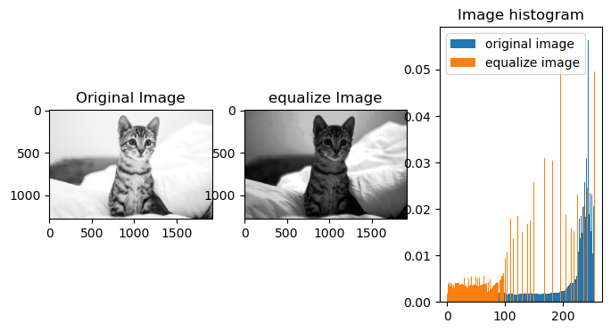

原圖的像素較集中於高亮度區域；處理後亮度分布向中、低灰階展開，貓咪與背景暗部變深，明暗反差更明顯。更新後兩種方法在本張影像得到相同結果；直方圖仍有尖峰，並非每個灰階值的像素數都相同。

## 兩種方法的差異

| 比較項目 | OpenCV（cv2） | 本次 NumPy 實作 |
|---|---|---|
| 實作方式 | 呼叫 `cv2.equalizeHist(gray_img)` | `np.bincount()` → 累積分布（CDF）→ 建立查找表 |
| 直方圖統計 | 按 0–255 的整數灰階統計 | 使用 `minlength=256` 統計各整數灰階次數 |
| CDF 正規化 | 非恆定影像扣除第一個非零累積值，再縮放至 0–255 | 使用 `255 × (cdf - cdf_min) / (cdf[-1] - cdf_min)` |
| 像素映射 | 以內建查找表映射 | 使用 `np.rint()` 取整、裁切至 0–255，再以 `lut[image]` 映射 |
| 輸出型態 | `uint8` | `uint8` |
| 100 次平均耗時 | **1.12510 ms** | **12.60169 ms** |


**執行時間：** 本次 cv2 耗時約為 NumPy 的 **1/11.20**。兩者輸出相同，但目前 NumPy 實作的執行時間較長。

**實測差異：** 最新像素比較輸出為 **0.0**，表示本張影像的兩種結果逐像素一致，MAE 為 **0**。
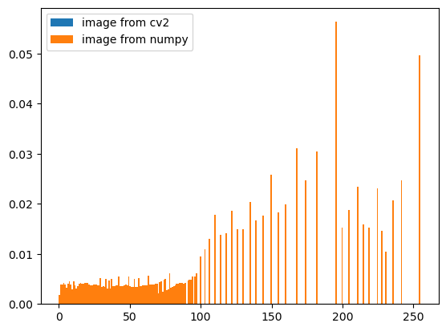

兩張結果的直方圖完全重疊。

---

# Quiz 3：梯形校正與透視轉換

## 一、實作目標

使用 `Code/document_scanner.py` 自動找出文件或卡片的四角，將斜拍影像裁切並轉換為矩形。輸入為 OpenCV  影像，成功時回傳校正影像，找不到合格文件時回傳 `None`。同一套流程處理不同照片，不手動指定角點。

## 二、完整流程與各步驟目的

**原圖 → 縮圖 → 灰階 → GaussianBlur → Canny → 閉運算 → 輪廓與四角候選 → 篩選與排序 → 換回原圖座標 → 透視轉換。**

| 步驟 | 實作內容 | 目的 |
|---|---|---|
| 1. 輸入影像 | 接收三通道 BGR 影像 | 統一資料格式，保留原圖供最後校正 |
| 2. 縮小影像 | 長邊最多 1200 像素，小圖不放大 | 降低運算量與細碎紋理的影響，讓固定大小的濾波器在較一致的尺度工作 |
| 3. 灰階轉換 | `cv2.COLOR_BGR2GRAY` | 將顏色轉為亮度資訊，供後續偵測明暗變化 |
| 4. 高斯模糊 | `GaussianBlur`，核心 `5×5` | 平滑雜訊與細小紋理，減少不必要的邊緣 |
| 5. 邊緣偵測 | Canny 依序嘗試 `(50,150)`、`(25,75)`、`(75,200)` | 找出亮度變化較大的位置，並以多組門檻適應不同影像 |
| 6. 閉運算 | `MORPH_CLOSE`，核心 `3×3` | 連接較小的邊界斷裂，增加形成完整外框的機會 |
| 7. 擷取輪廓 | `findContours`，每組門檻取面積最大的前 30 個輪廓 | 從邊緣像素整理出物體邊界，限制後續候選搜尋量 |
| 8. 建立四角候選 | 對輪廓及凸包使用多組 `approxPolyDP` 容許誤差；加入符合條件的旋轉外接矩形 | 將文件外框近似成凸四邊形，容許輕微不規則邊緣 |
| 9. 處理圓角 | 取四邊中段輪廓點，以 `fitLine` 擬合直線，取相鄰直線交點 | 估算圓角文件的虛擬四角，避免要求文件必須具有尖角 |
| 10. 篩選並評分 | 檢查凸性、重疊程度、角點範圍及邊長；面積占圖比例須介於 2% 與 98% | 排除過小或不合理的候選，再以「面積占比 × 與凸包的重疊程度」選取最高分結果 |
| 11. 四角排序及座標還原 | 排成左上、右上、右下、左下，依縮放比例換回原圖座標 | 建立一致的角點對應，讓最終校正使用原圖解析度 |
| 12. 透視轉換 | 以 `getPerspectiveTransform` 求矩陣，再用 `warpPerspective` 產生矩形影像 | 拉正梯形外觀並裁去文件周圍背景 |

流程圖只顯示最終選用的 Canny 門檻及其閉運算、輪廓結果；實際偵測仍會比較三組門檻。辨識失敗時顯示第一組門檻作為診斷預覽。程式本身不儲存圖片，以下報告插圖取自 Notebook 已儲存輸出。

## 三、成功擷取結果

代表影像為 `20260922_232301.jpg`。卡片與桌面的亮度差異足夠，邊緣能形成外框，程式成功估算四角並裁切出卡片。圓角也能透過虛擬四角處理，但矩形輸出的角落可能保留少量背景。

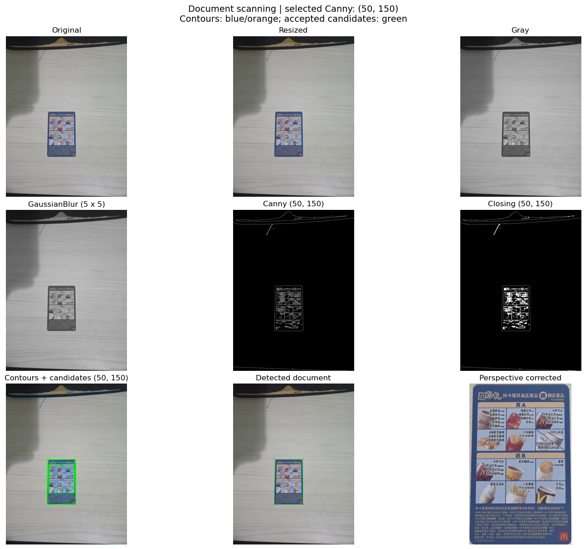

本次六張角度照片皆能成功擷取。此處「成功」指找到文件四角並產生裁切結果，不代表已還原正確的實體長寬比例。

## 四、不同拍攝角度的結果

下圖由左至右為 Image 1～6，上排為原圖，下排為擷取結果。整體由較接近正面逐步轉向更斜的視角。

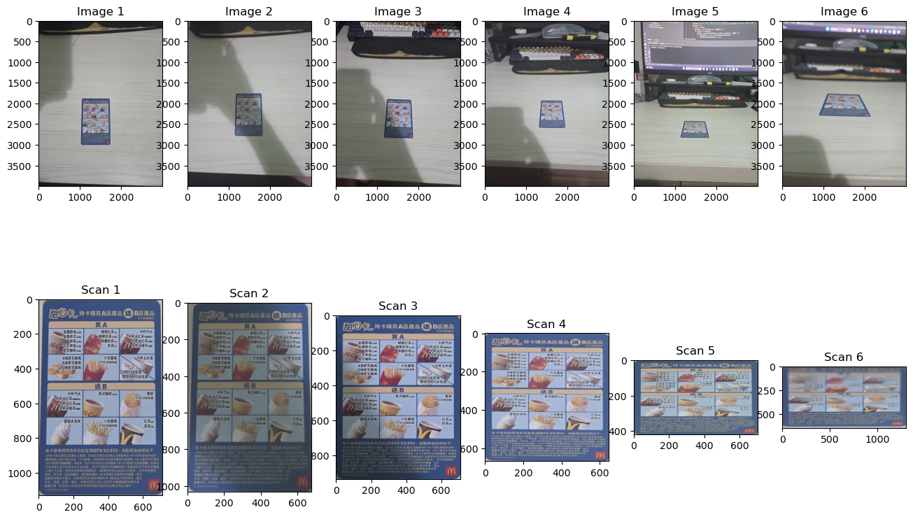

| 圖片 | 檔名 | 擷取結果 | 複核輸出寬 × 高（像素） | 寬／高 |
|---|---|---|---:|---:|
| Image 1 | `20260922_232301.jpg` | 成功，保留直立長方形外觀 | 713 × 1127 | 0.633 |
| Image 2 | `20260922_232258.jpg` | 成功，比例與第一張接近 | 677 × 1033 | 0.655 |
| Image 3 | `20260922_232256.jpg` | 成功，開始顯得較扁 | 708 × 938 | 0.755 |
| Image 4 | `20260922_232254.jpg` | 成功，結果接近正方形 | 646 × 668 | 0.967 |
| Image 5 | `20260922_232249.jpg` | 成功，垂直方向明顯壓縮 | 701 × 416 | 1.685 |
| Image 6 | `20260922_232107.jpg` | 成功，壓縮更明顯，文字也較模糊 | 1279 × 619 | 2.066 |


**越傾斜，圖片比例越不正確的原因：** 目前輸出寬度取照片中上、下兩邊的較長值，高度取左、右兩邊的較長值：

```text
width  = max(上邊長, 下邊長)
height = max(左邊長, 右邊長)
```

這些是照片中的投影長度，不是文件的真實長寬。當相機視線越接近桌面，卡片沿深度方向的投影越短；程式又直接以投影邊長設定輸出尺寸，因此雖然把外框拉成矩形，內容仍會變扁。這組照片的寬高比由 0.633 增至 2.066，呈現相同趨勢；沒有實體尺寸作為真值，不能將此表當成比例誤差的精確量測。

若已知卡片的真實寬高比，可用固定目標比例建立矩形；未知比例時，需要額外幾何資訊才能更可靠地恢復比例。大角度下的細節壓縮與模糊，也不能單靠透視轉換完整恢復。

## 五、主要失敗案例：文件與背景對比不足

`20260922_232347.jpg` 未能擷取，函式回傳 `None`。文件部分外緣與淺色桌面相近；由流程圖可見，文件內部圖案的邊緣較清楚，但外框未完整連接。即使經過閉運算，仍未產生通過篩選的四角候選。

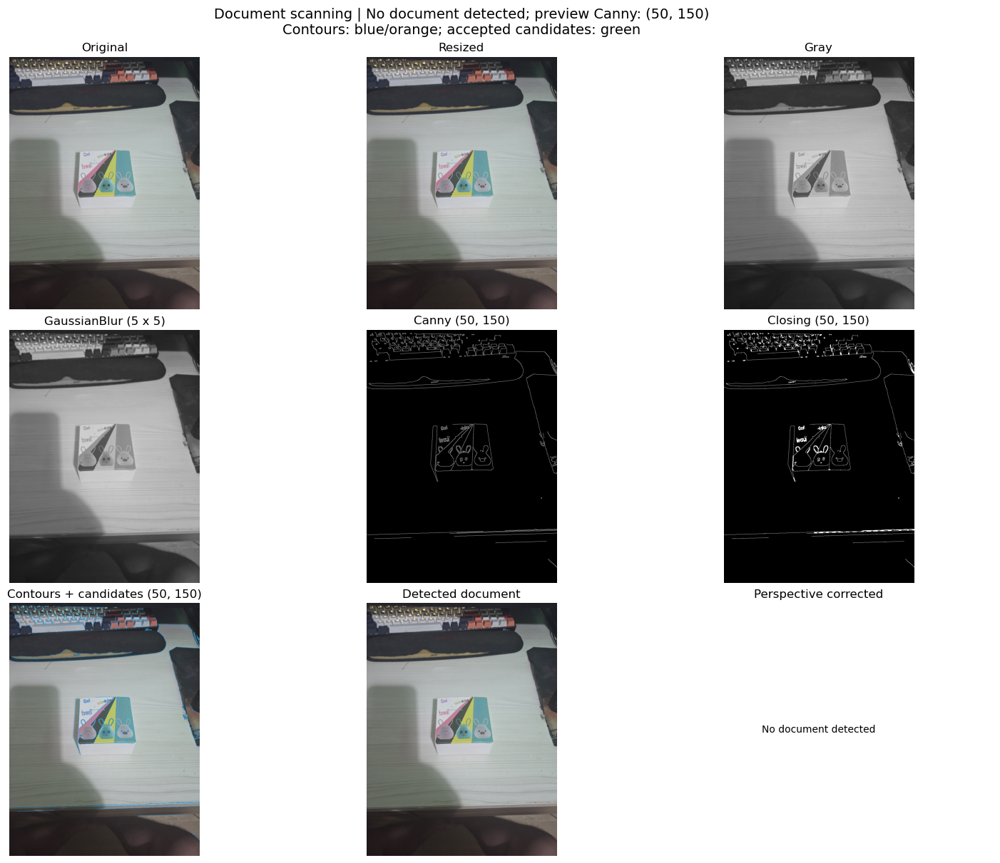

依此案例觀察，主要限制是**文件外框與背景的亮度對比不足**：灰階化後邊界差異較弱，Canny 容易漏掉部分外緣；閉運算只能補較小的斷裂，無法補回大段缺失的邊界。這是根據影像與中間結果的分析，尚未用控制背景顏色的實驗隔離其他影響，例如陰影或背景紋理。

## 六、結論

本次同一套自動流程成功擷取六張不同視角的卡片，並在一張低對比案例中失敗。結果顯示，**文件定位成功與比例校正正確是兩件事**：大角度仍可能找得到四角，但目前依投影邊長決定尺寸，容易造成比例失真；當文件與背景對比不足時，則可能在邊界偵測階段就無法形成完整候選。

---

# Quiz 4：影像拼接

## 一、實驗資料與設定

使用 `shot-panoramic-composition-living-room.jpg`，透過 `Code/panorama_views.py` 從同一張 360° 全景圖擷取不同視角，再以 SIFT 特徵匹配與透視轉換進行拼接。`yaw` 表示水平朝向，`roll` 表示相機側傾角；實驗皆設定 `pitch=0`、水平視野角 `hfov=80°`。

| 實驗 | 水平朝向 yaw | 側傾角 roll | 每張影像尺寸 |
|---|---|---|---|
| 基本檢查 | `[10°, 10°]` | `[0°, 0°]` | 960 × 640 |
| 水平角度差 | `[10°～90°, 0°]`，每次增加 10° | `[0°, 0°]` | 480 × 320 |
| 相機側傾 | `[30°, 0°]` | `[10°～180°, 0°]`，每次增加 10° | 960 × 640 |


## 二、拼接流程與目的

| 步驟 | 實作 | 目的 |
|---|---|---|
| 1. 灰階轉換 | `cv2.COLOR_BGR2GRAY` | 以亮度結構進行特徵偵測 |
| 2. SIFT 特徵擷取 | `detectAndCompute()` | 找出關鍵點，建立局部特徵描述子 |
| 3. 尋找匹配 | FLANN，KD-tree `trees=5`、`checks=50`，`k=2` | 為每個描述子尋找兩個最近的候選 |
| 4. 比例篩選 | 最近距離小於次近距離的 `0.5` 倍 | 排除辨識度不足的匹配；通過者至少需 10 個 |
| 5. 估算轉換 | `findHomography()`，RANSAC 門檻 5 像素 | 估算第一張映射到第二張的矩陣，降低錯誤匹配影響 |
| 6. 建立畫布 | 轉換第一張四角，與第二張四角合併計算範圍 | 取得拼接畫布大小，加入平移避免負座標 |
| 7. 影像合成 | `warpPerspective()` 後，將第二張直接覆蓋到畫布 | 將兩張影像置於同一座標系統 |


## 三、基本檢查

兩張輸入的朝向與側傾角完全相同，能建立大量匹配並產生輸出。

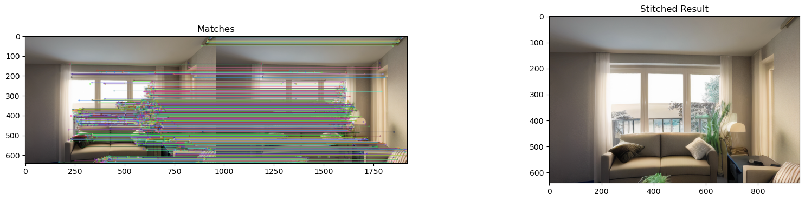

## 四、水平角度差與重疊範圍

保持第二張朝向為 0°，逐步增加第一張的水平朝向。當兩者 `pitch=roll=0`、水平視野皆為 80° 時，水平角度重疊為 `max(0, 80° - 角度差)`；此處比例是角度重疊比例，不是像素面積重疊率。

| 水平角度差 | 水平角度重疊比例 | 已儲存結果 |
|---:|---:|---|
| 10° | 87.5% | 產生拼接影像，場景可辨識 |
| 20° | 75% | 產生拼接輸出 |
| 30° | 62.5% | 產生拼接影像，外側開始明顯拉伸並出現黑邊 |
| 40° | 50% | 仍有輸出，但外側拉伸與畫布變形更明顯 |
| 50° | 37.5% | 輸出畫布異常放大、大面積黑底，不能視為有效拼接 |
| 60° | 25% | 仍有匹配圖與輸出，但有效內容只占很小部分，品質不佳 |
| 70° | 12.5% | 僅 2 個匹配通過篩選，低於 10 個門檻，程式停止 |
|  |

**10°：重疊較多，場景可辨識。**

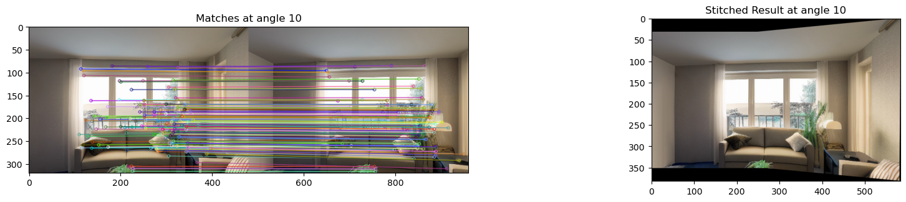

**30°：能擴大可見範圍，但外側已有透視拉伸。**

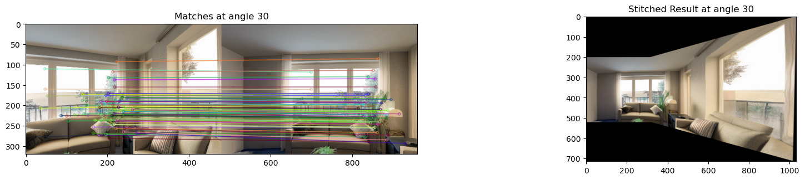

**50°：即使產生輸出，畫布與內容已明顯異常。**

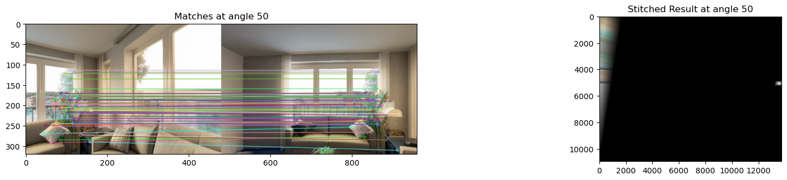

**60°：大部分畫布為黑色，只留下小區域內容。**

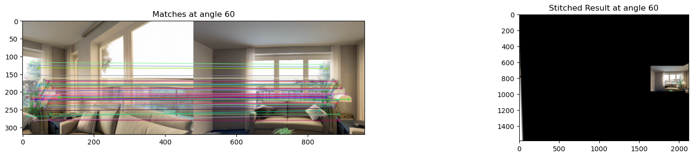

**原因分析：** 角度差增加時，共同可見區域減少，可用匹配也受到限制；本次在 70° 只剩 2 個合格匹配，直接觸發失敗條件。但有足夠匹配不保證整張影像能合理投影到第二張的平面。

本次使用單一透視平面，視野越寬，外側投影越容易被拉長。幾何上，第一張朝向達 50°、半視野為 40°，其最外側已接近相對第二張的 90° 方向，投影可能接近無限遠；60° 更跨過此界線。

## 五、相機側傾角的影響

固定兩張水平朝向為 `[30°, 0°]`，將第一張側傾角從 10° 增加到 180°，共 18 組。既有輸出顯示各組皆產生匹配圖與拼接影像，沒有觸發匹配不足的停止訊息。

| 側傾角 | 觀察 |
|---|---|
| 10°～180°，每隔 10° | 18 組皆有輸出；未量測各組內點率或重投影誤差 |
| 90° | 第一張明顯側轉，仍能對應到第二張的場景特徵 |
| 180° | 第一張上下顛倒，仍可匹配並映射到第二張方向 |

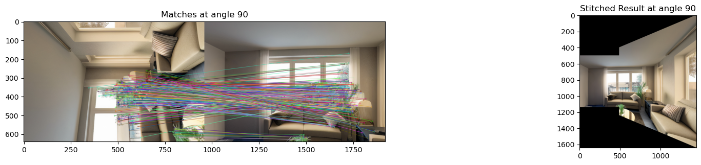

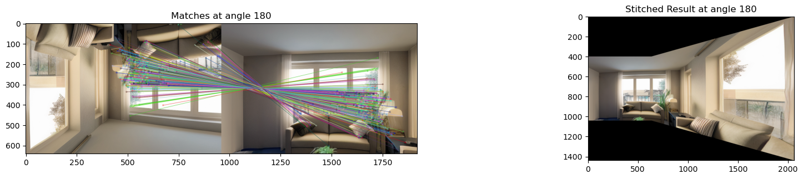

此結果與 SIFT 以關鍵點方向建立旋轉不變描述的設計相符。

側傾也會改變矩形視窗涵蓋的區域，故本組不只有內容方向改變，實際重疊範圍亦可能不同

## 六、限制與結論

本次實作可用 SIFT、FLANN 與 RANSAC 完成具有重疊區域的視角對齊。水平角度差增加後，拼接品質先出現拉伸與異常畫布，再於 70° 因匹配不足停止；側傾測試則在 10°～180° 的已測條件下皆有輸出。